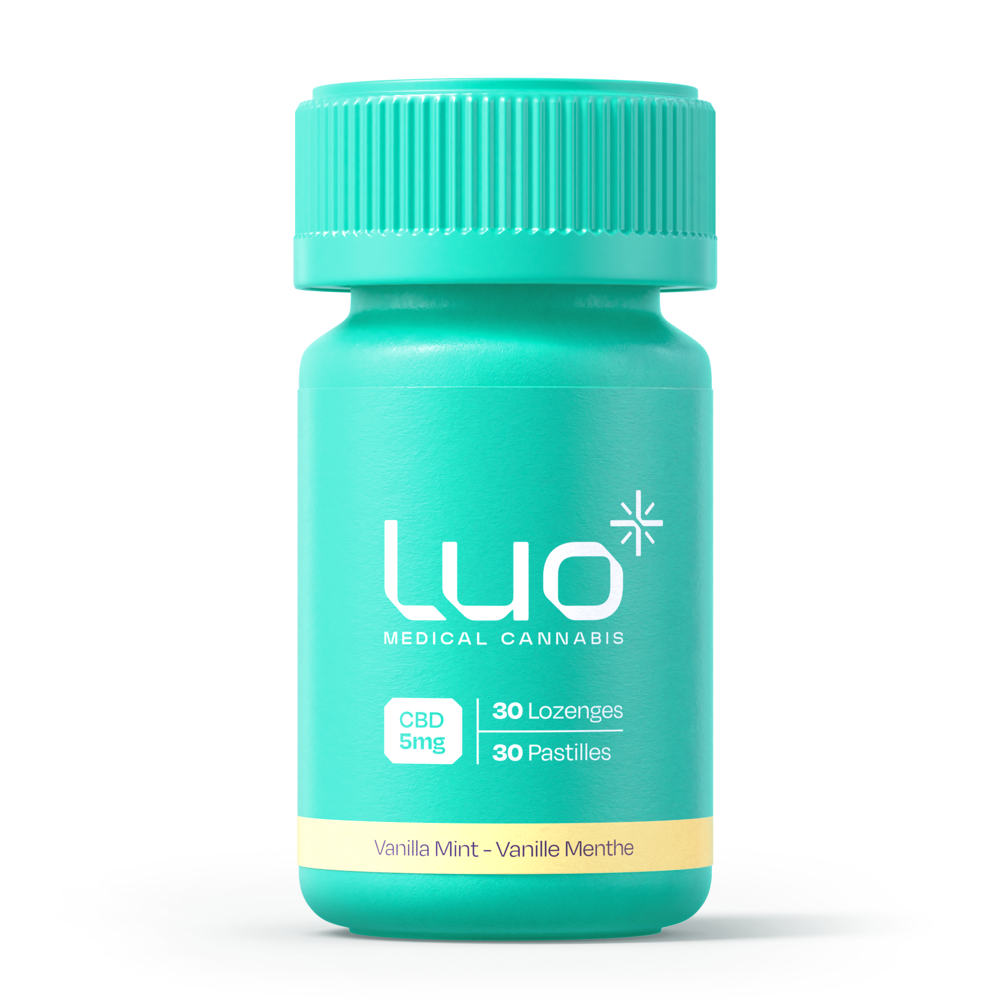
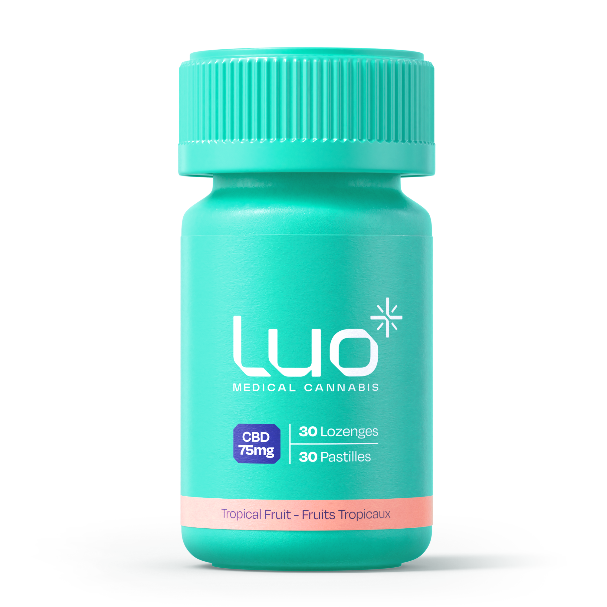

<!-- source: https://www.luomedical.com/ca/patient/ -->

# Illuminate *Possibilities*

Luo is committed to supporting people's wellbeing by shining a light on a new way to take medical cannabis.

[Order Luo](#products)

| Section Metadata |  |
| ---------------- | ---------- |
| style            | bg-hero, hero-patient |

---

## We challenge the stigma of medical cannabis while **bringing real hope** to those who need it most.

And, because we're committed innovators, we've developed a new product that does just that.

Trying new things can feel like venturing into the unknown, but we're illuminating the path to help you explore medical cannabis with confidence.

[Order Luo](luo-medical-cbd-lozenges)

| Section Metadata |  |
| ---------------- | ---------- |
| style            | bg-white, mission |

---

## Luo high-quality **CBD lozenges**

Luo provides high-quality CBD in an easy and convenient form – more discreet than smoking or vaporizing and more precise than CBD oils.

Available in three strengths to help you reliably manage your dosage, Luo helps you enjoy the benefits of CBD without the psychoactive effects associated with THC.

[Order Luo](#products)

| Section Metadata |  |
| ---------------- | ---------- |
| style            | bg-product, banner-left |

---

### Find your Luo

| Cards |
| ----- |
|  **Luo CBD Vanilla Mint Lozenges** Experience the unique, dissolvable format of Luo lozenges in a bold vanilla mint flavour – available in 3 CBD strengths. [Learn More](luo-medical-cbd-lozenges) |
|  **Luo CBD Tropical Fruit Lozenges – new!** Count on the same Luo quality you know, but in a tropical fruit flavour – available in 2 CBD strengths. [Learn More](luo-medical-cbd-lozenges-2) |

| Section Metadata |  |
| ---------------- | ---------- |
| style            | bg-cream, products |

---

### Why Luo?

Here to **support you** on your wellbeing journey

| Cards |
| ----- |
|  **Ease** Oral lozenges are convenient and easy to use. |
|  **Quality** High-dose CBD options without the psychoactive effects associated with THC. |
|  **Unique Format** Luo lozenges easily dissolve in your mouth with a pleasant vanilla mint flavour. |
|  **Reliability** Consistent formulation to help you precisely and reliably manage your dosage. |
|  **Confidence** Luo is committed to meeting the highest quality standards. |

| Section Metadata |  |
| ---------------- | ---------- |
| style            | bg-even, features |

---

### What is **medical cannabis**?

Understanding medical cannabis can be complex. Our FAQs are here to help you navigate this new terrain with ease.

[Learn more](medical-cannabis-guide)

### What is **CBD**?

Our CBD FAQs are designed to help people who are new to CBD explore the topic with no-nonsense information.

[Learn more](medical-cannabis-guide)

| Section Metadata |  |
| ---------------- | ---------- |
| style            | bg-odd, faq, two-col |

---

| Metadata | |
| -------- | --------- |
| Title | Luo - Patient Portal |
| Description | Luo Medical Canada Patient Portal - Illuminate Possibilities |
